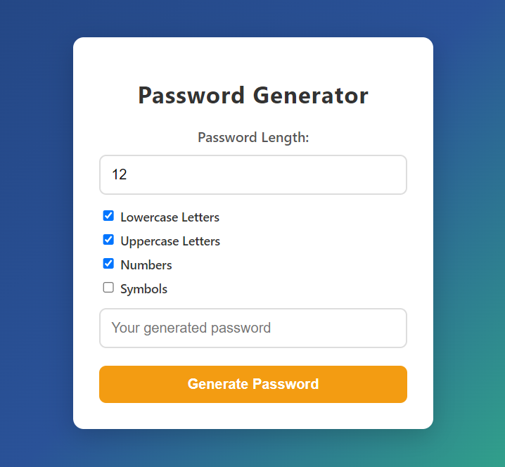

# Password Generator with JavaScript, HTML, and CSS

This project is a customizable password generator built with **JavaScript**, **HTML**, and **CSS**. It allows users to generate random passwords with various customization options such as including lowercase letters, uppercase letters, numbers, and symbols, and selecting the desired length of the password.

## Table of Contents
- [Screenshot](#screenshot)
- [Features](#features)
- [Prerequisites](#prerequisites)
- [Usage](#usage)
- [Contact](#contact)

## Screenshot



<p align="right">(<a href="#table-of-contents">back to top</a>)</p>

### Built With

This project was built using only the following technologies:

* 
* 
* 

<p align="right">(<a href="#table-of-contents">back to top</a>)</p>

## Features

- Set the password length (between 4 and 32 characters).
- Choose to include:
  - Lowercase letters
  - Uppercase letters
  - Numbers
  - Symbols
- Dynamic error handling (e.g., warning if no options are selected).
- Modern and clean interface with responsive design.

<p align="right">(<a href="#table-of-contents">back to top</a>)</p>

## Prerequisites

To run this project, you only need a browser that supports HTML, CSS, and JavaScript. No additional libraries or dependencies are required.

<p align="right">(<a href="#table-of-contents">back to top</a>)</p>

## Usage

1. Clone the project from GitHub or download the files:
   ```bash
   git clone https://github.com/AmirrezaAhmadi/PasswordGenerator-App.git

## Contact

You can reach me through the following:

* Email: AmirrezaAhmadi.GH@Gmail.com
* Telegram: https://t.me/AmirrezaDevelop
* Instagram: https://www.instagram.com/codewithamirreza
* Project Link: https://github.com/AmirrezaAhmadi/PasswordGenerator-App.git

<p align="right">(<a href="#table-of-contents">back to top</a>)</p>
